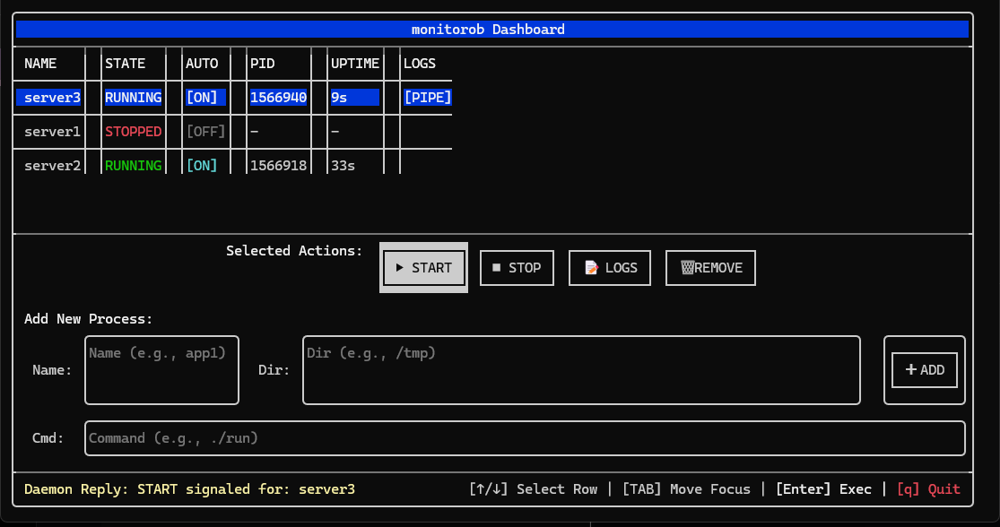

  monitorob - C++ Process Supervisor & TUI Dashboard
===

【概要】
monitorobは、指定したプログラムをバックグラウンドで起動・監視し、
万が一クラッシュした際には自動で再起動を行うプロセス管理ツール（スーパーバイザー）です。
リッチなターミナルUI（TUI）を通じて、プロセスの状態確認、ログの取得、安全な停止などの操作を直感的に行えます。

【システムアーキテクチャ】
本システムはクライアント・サーバーモデルを採用しています。
1. monitorob_server (デーモン):
   - プロセスの死活監視、自動再起動、ログのバッファリングを行うバックエンド。
   - systemdによりOSのバックグラウンドサービスとして常駐します。
   - 通信ソケット: /tmp/monitorob.sock
   - 設定ファイル: servers.conf (サーバーと同じディレクトリに自動生成)

2. monitorob_tui (クライアント):
   - サーバーにソケット通信で接続し、状態を描画するフロントエンド。
   - どのディレクトリから呼び出しても動作します。

   

--------------------------------------------------------------------------------
【インストールと起動手順】

1. ビルド
    ```
    $ mkdir build && cd build
    $ cmake ..
    $ make -j4
    ```

2. サーバーのデーモン化 (systemdへの登録)
   buildディレクトリ内で以下のスクリプトを実行します。
   ```
   $ sudo bash install_service.sh
   ```
   (※これによりOS起動時にサーバーが自動で立ち上がるようになります)

3. TUIコマンドのパス通し
    ```
    $ sudo bash setup_tui.sh
    ```
   (※これにより、どこからでも `monitorob` コマンドでダッシュボードが開けます)

--------------------------------------------------------------------------------
【TUIダッシュボードの操作方法】

ターミナルで `monitorob` と入力して起動します。

■ キーバインド
  - [↑] / [↓] または [k] / [j] : プロセスリストの選択行を移動
  - [TAB]                      : ボタンや入力フォームへのフォーカス移動
  - [Enter]                    : 選択しているボタンの実行
  - [q]                        : ダッシュボードを閉じる (サーバーと管理プロセスは動き続けます)

■ アクション
  - [▶ START]  : プロセスの自動起動フラグをONにし、起動します。
  - [■ STOP]   : プロセスの自動起動フラグをOFFにし、SIGTERM(安全な終了)を送信します。
                 ※5秒間待機しても終了しない場合は、SIGKILLで強制終了します。
  - [📝 LOGS]   : ログ出力のON/OFFを切り替えます。
                 ONにすると、TUIを実行したカレントディレクトリの `log/` フォルダ内に
                 「プロセス名.log」というファイルが生成され、直近100行の出力と
                 リアルタイムの出力がパイプされます。
                 ※安全のため、出力開始から10分経過すると自動でストップします。
  - [🗑 REMOVE] : プロセスを停止させ、管理リスト(servers.conf)から削除します。

■ Add New Process (新規プロセスの追加)
  [TAB]キーで画面下部のフォームに移動し、以下の3つを入力して[✚ ADD]を押します。
  - Name : 管理名 (他と被らない一意のID。例: web_server)
  - Dir  : 作業ディレクトリの絶対パス (例: /home/user/app)
  - Cmd  : 実行するコマンドと引数 (例: python3 main.py --port 8080)

--------------------------------------------------------------------------------
【トラブルシューティング】

Q: TUIを開いたときに「ERROR: Cannot connect to server」と出る。
A: サーバー(monitorob_server)が起動していません。
   `systemctl status monitorob.service` でデーモンの状態を確認してください。
   手動で起動する場合は `./monitorob_server` を実行してください。

Q: プロセスを追加してもすぐに「STOPPED」になってしまう。
A: コマンドやディレクトリの指定が間違っており、起動直後にクラッシュしている可能性が高いです。
   該当プロセスの「LOGS」をONにして、出力されるエラーメッセージを確認してください。
   ※クライアントを実行しているディレクトリにlogフォルダが生成されます。

Q: 古いソケットファイルが残ってしまい起動できない。
A: サーバーが強制終了されると `/tmp/monitorob.sock` が残ることがあります。
   `rm /tmp/monitorob.sock` で削除してから再起動してください（スクリプト経由なら自動で削除されます）。

## Contributing

Pull requests are welcome. For major changes, please open an issue first to discuss what you would like to change.

## License

[MIT](https://choosealicense.com/licenses/mit/)

※このコードの一部はGeminiを使って書かれています。
